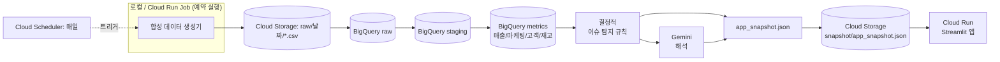
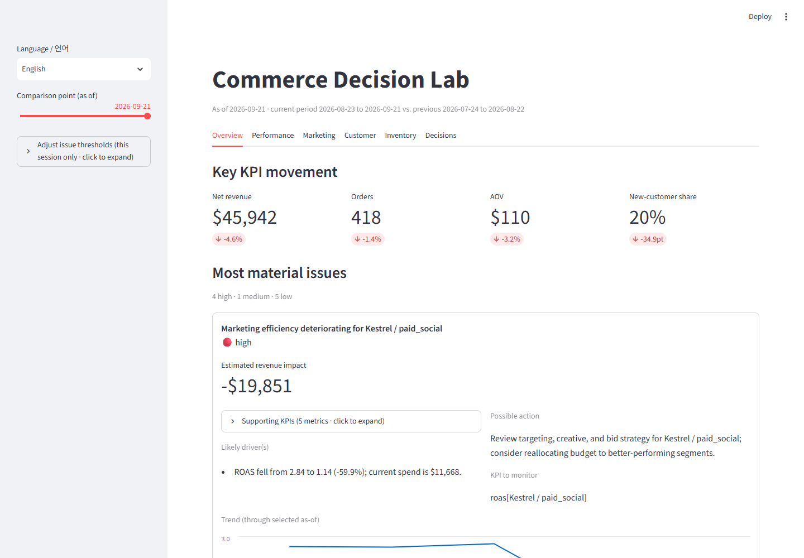
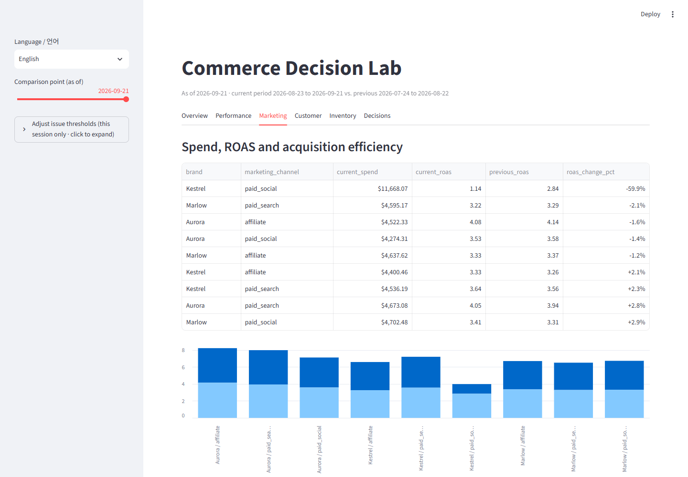
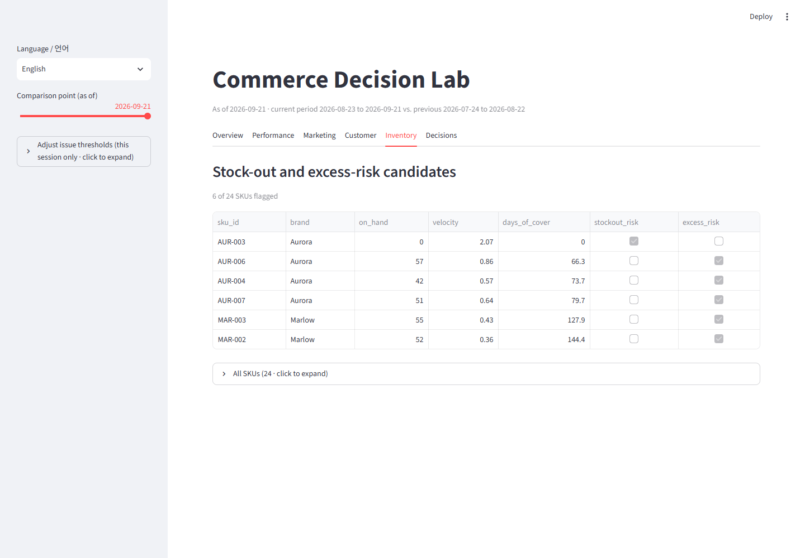
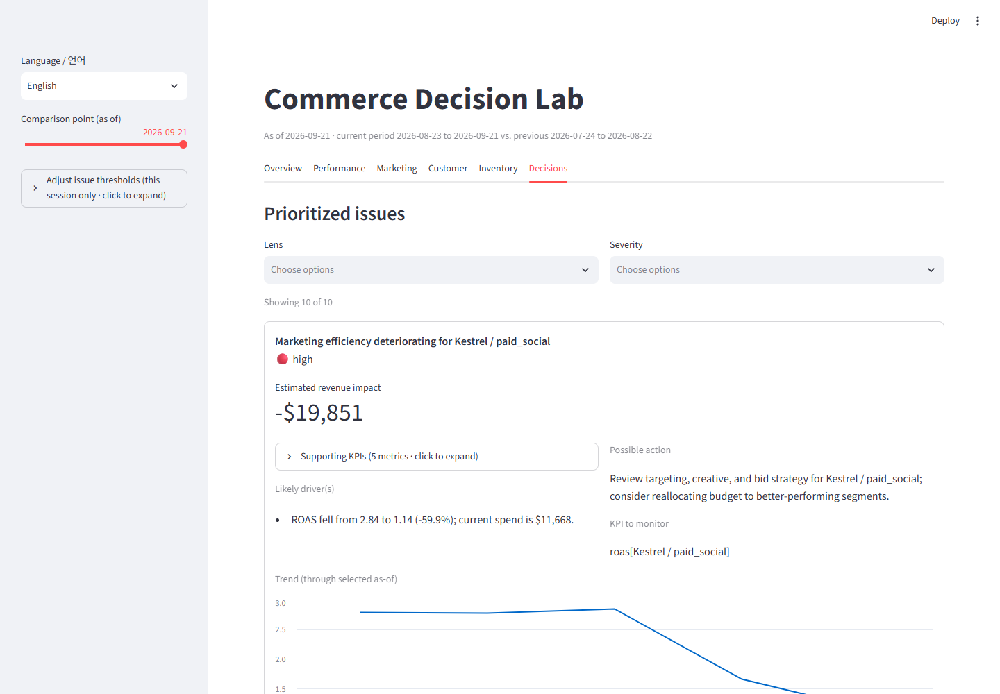
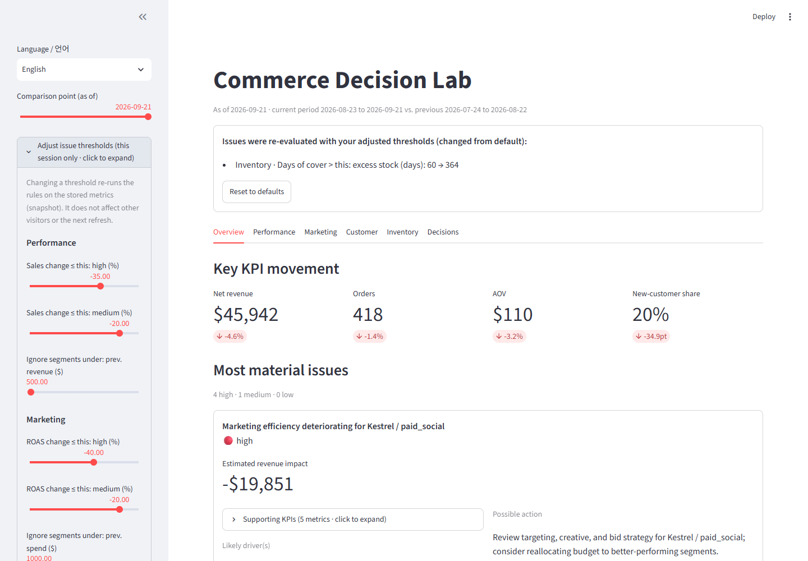

# Commerce Decision Lab

파편화된 합성 커머스 데이터를 경영 의사결정의 근거로 바꾸는 Google Cloud 포트폴리오 샘플: **무엇이 바뀌었고, 왜 바뀌었고, 무엇에 주목해야 하고, 어떻게 해야 하는지**를 보여준다 -- 위에 얹힌 AI가 아니라 그 아래의 결정적 계산이 중심이다.

프로덕션 커머스 플랫폼이 아니라 데모이며, 실제 회사/고객 데이터를 쓰지 않는다. 전체 스펙: [`PROJECT.md`](PROJECT.md). 진행 로그와 결정 사항, 클라우드 검증 여부: [`PROGRESS.md`](PROGRESS.md), [`docs/verification.md`](docs/verification.md).

**발표자 없이 이 프로젝트를 처음 접한다면** [내러티브 랜딩페이지](https://yimsemin.github.io/commerce-decision-demo/)부터 보는 걸 권한다 -- 4개의 심어진 비즈니스 이슈 중 하나를 직접 골라, 데이터 패턴 → 증거 화면 → 시스템의 판단까지 끝까지 따라가 볼 수 있다. 소스는 [`docs/index.html`](docs/index.html)이며, GitHub Pages가 `main` 브랜치의 `docs/` 폴더를 그대로 서빙한다(별도 빌드 없음).

## 비즈니스 문제

여러 브랜드, 판매 채널, 유료 마케팅을 운영하는 가상의 회사가 있다. 실제로 성장 중인 회사가 그렇듯 데이터는 시스템별로 파편화되어 있다. 경영/전략 담당자는 빠르게 답을 얻어야 한다: 매출에서 실질적으로 무엇이 바뀌었나? 어떤 브랜드/채널/SKU가 원인인가? 마케팅 효율은 좋아지고 있나 나빠지고 있나? 고객 획득/재구매 패턴이 바뀌고 있나? 어떤 SKU가 품절/과잉재고 위험인가? 지금 무엇에 주목해야 하고, 과거의 조치는 실제로 효과가 있었나?

가치는 화려한 대시보드가 아니라, 계산 과정을 끝까지 추적할 수 있는 의사결정 시스템에 있다 -- 앱의 모든 숫자는 그것을 계산한 SQL/Python까지 거슬러 올라갈 수 있다.

## 아키텍처



| 컴포넌트 | 존재 이유 |
|---|---|
| 합성 데이터 생성기 | 이 프로젝트가 쓰는 유일한 데이터를 만든다 -- 결정적이고 시드 기반이며, 심어놓은 4개 비즈니스 시나리오를 포함해([`docs/synthetic_data.md`](docs/synthetic_data.md)) 나머지 시스템이 탐지할 진짜 대상을 제공한다 |
| Cloud Storage | 원본 CSV의 집결지이자, 앱이 읽는 유일한 파일(`snapshot/app_snapshot.json`)이 있는 곳 -- 앱을 BigQuery와 완전히 분리한다 |
| BigQuery (raw/staging/metrics) | 결정적 근거(source of truth). raw는 CSV를 그대로 반영, staging은 얇은 타입/중복제거 레이어, metrics는 문서화된 KPI 공식([`docs/kpi_definitions.md`](docs/kpi_definitions.md)) |
| 의사결정 규칙 (Python) | metrics 레이어 위에서 동작하는 결정적, 임계값 기반 이슈 탐지([`docs/decision_rules.md`](docs/decision_rules.md)) -- "무엇이 문제인지"는 AI가 아니라 이 로직이 정한다 |
| Gemini (Vertex AI) | 이미 계산된 의사결정 항목을 평이한 문장으로 서술한다. 사실을 만들거나 심각도를 바꿀 수 없다([`docs/gemini_integration.md`](docs/gemini_integration.md)) |
| Cloud Run (앱) | Streamlit 경영 앱을 서빙한다. 공개 트래픽은 항상 스냅샷 파일만 읽는다 -- BigQuery나 Gemini를 직접 호출하지 않는다 |
| Cloud Run Job + Cloud Scheduler | 전체 리프레시(생성 → GCS → BigQuery → metrics → decisions → Gemini → snapshot)를 매일 실행한다. 같은 명령을 로컬 CLI로도 수동 실행할 수 있다 |

## 데이터/메트릭 흐름

1. `commerce_lab.datagen`이 고정 시드로 CSV 5개(orders, marketing, inventory, customers, skus)를 생성한다.
2. `commerce_lab.pipeline.ingest`가 이를 GCS에 올리고 BigQuery `raw` 테이블에 적재한다. `sql/staging/*.sql`이 그 위에 타입이 지정된 뷰를 만든다.
3. `sql/metrics/*.sql`(로컬 개발/테스트용으로 `commerce_lab.metrics`에 미러링)이 현재-대-이전 기간 KPI를 계산한다: 매출, 마케팅(지출/ROAS/CAC), 고객(신규-재구매 비중, 재구매율), 재고(소진 일수, 품절/과잉 위험).
4. `commerce_lab.decisions.rules`가 이 KPI에 고정 임계값을 적용해 구조화된 `DecisionItem`을 만든다: 이슈, 근거 KPI, 유력 원인, 영향받는 브랜드/채널/SKU, 심각도, 가능한 조치, 이후 모니터링할 KPI.
5. `commerce_lab.gemini`가 선택적으로 그 의사결정 항목들을 짧은 경영진 요약으로 서술한다 -- 오직 그 구조에만 근거하며 원본 데이터는 절대 보지 않는다.
6. `commerce_lab.pipeline.snapshot`이 모든 것을 `app_snapshot.json` 하나로 묶는다. Streamlit 앱이 읽는 유일한 산출물이다 -- 기준일 하나가 아니라, 120일 합성 기간 안에서 60일 이상의 히스토리를 확보할 수 있는 여러 기준일(anchor)마다 각각 현재-대-이전 30일 비교를 미리 계산해 함께 담는다. Gemini 요약은 최신 기준일 하나에만 생성한다(비용/지연 절감).

결정적 분석이 끝나고 Gemini가 시작되는 지점: **4단계까지는 전부 결정적이고 독립적으로 테스트 가능하다. 5단계만 생성형 모델을 호출하며, 서술만 추가할 수 있을 뿐 숫자는 하나도 바꾸지 못한다.**

## 의사결정 지원 로직

합성 데이터에는 4개 시나리오가 의도적으로 심어져 있고([`docs/synthetic_data.md`](docs/synthetic_data.md)) 각각 대응하는 규칙이 이를 잡아낸다([`docs/decision_rules.md`](docs/decision_rules.md)): 마케팅 ROAS 악화, 품절로 향하는 SKU, 특정 세그먼트에 집중된 매출 하락, 신규-재구매 고객 구성 변화. "조치가 효과가 있었나?"는 별도 기능이 아니다 -- 실제 개입 후 더 최신 데이터로 같은 규칙을 다시 평가하면, KPI가 회복된 순간 규칙이 더 이상 발동하지 않는다(`tests/test_decisions/test_post_action_verification.py`에서 확인).

앱 사이드바에서 **비교 시점(기준일)**을 슬라이더로 바꿔볼 수 있다 -- 앱은 여전히 스냅샷 파일 하나만 읽으며(BigQuery/Gemini를 그 자리에서 호출하지 않음), 이미 계산되어 있는 여러 기준일 중 하나를 고를 뿐이다. 이른 시점으로 이동하면 심어진 이슈들이 아직 high 심각도로 발전하기 전 단계(medium/low)가 보여, 이슈가 시간에 따라 쌓여가는 과정을 확인할 수 있다.

이슈 카드는 %뿐 아니라 계산 가능한 경우 **예상 매출 영향($)**도 보여주고, 여러 기준일 히스토리를 이용한 **추세 미니 차트**를 함께 표시한다. Overview의 "가장 중요한 이슈" 정렬은 심각도가 여전히 1차 기준이고(규칙이 내린 판단을 $값으로 뒤집지 않음), 같은 등급 안에서만 $영향 크기로 2차 정렬한다.

## 확장과 커스터마이징

경영진이 "이 관점으로도 보고 싶다"고 할 때를 위해, 분석 관점을 **Lens 하나 = 모듈 하나**로 분리했다([`src/commerce_lab/lenses/`](src/commerce_lab/lenses/)). 매출/마케팅/고객/재고도 같은 구조의 기본 관점이다. 관점 모듈은 KPI 계산, 이슈 규칙, 조정 가능한 임계값, 앱 탭, 한/영 문장, (필요하면) 새 원천 데이터셋 정의를 한 곳에 담고, `config/lab.toml`에 이름을 추가하면 다음 리프레시부터 탭과 이슈에 반영된다.

- **경영진(앱 사용자):** 사이드바 "이슈 기준 조정"의 슬라이더로 임계값(예: ROAS 하락 %, 품절 기준 일수)을 바꾸면 저장된 지표로 이슈를 즉시 다시 판정한다. 기본값과 달라진 항목은 화면 상단 배너에 "60 → 365"처럼 표시되고, 버튼 하나로 되돌릴 수 있다. 그 세션에만 적용되며 BigQuery/Gemini 호출은 없다. 의사결정(Decisions) 탭에서는 관점/심각도로 걸러 볼 수 있다. 화면은 한국어/영어 모두 지원한다(탭 이름과 슬라이더 문구 포함).
- **운영자:** [`config/lab.toml`](config/lab.toml)로 사용할 관점과 임계값 기본값을 정한다.
- **개발자:** 새 관점(새 테이블 포함) 추가 절차는 [`docs/extending.md`](docs/extending.md).

## 언어

앱은 한국어/영어를 사이드바에서 전환할 수 있다(기본값 한국어). 의사결정 카드의 문장(이슈 제목/유력한 원인/제안 조치)은 결정 규칙이 만든 구조화된 사실(`issue_type`/`affected`/`supporting_kpi`)로부터 언어별로 각각 렌더링되며(공통 문구는 [`app/i18n.py`](src/commerce_lab/app/i18n.py), 이슈별 문장은 해당 관점 모듈), KPI 식별자(`kpi_to_monitor` 등)는 번역하지 않는다 -- 식별자와 서술을 구분하는 것은 이 프로젝트의 일관된 원칙이다(`CLAUDE.md` 참고). Gemini 경영진 요약은 리프레시당 한 번, 영어로만 생성되므로 한국어 화면에서는 항상 같은 근거의 결정적 대체 요약을 보여준다.

## 스크린샷

실제 로컬 실행(`streamlit run`)에서 캡처한 것으로, 목업이 아니다.

| Overview | Marketing |
|---|---|
|  |  |

| Inventory | Decisions |
|---|---|
|  |  |

`docs/screenshots/performance.png`, `docs/screenshots/customer.png`도 있다.

임계값을 조정하면 이슈가 즉시 다시 판정되고 상단 배너에 바뀐 항목이 표시된다:



접혀 있는 영역(근거 KPI, 전체 SKU, 임계값 패널, AI 프롬프트)은 제목에 "클릭하여 펼치기"와 내용 요약(예: 지표 5개)이 붙어 있다.

## 셋업 / 로컬 개발

Python 3.14 필요(`.python-version`에 고정; 이 경로는 클라우드 계정이 필요 없다).

```bash
python -m venv .venv
.venv/Scripts/pip install -e ".[dev]"        # macOS/Linux는 .venv/bin/pip
python -m commerce_lab.pipeline.refresh      # 데이터 생성 + data/generated/app_snapshot.json 생성
streamlit run src/commerce_lab/app/main.py   # 그 로컬 스냅샷으로 앱 실행
python -m pytest -q                          # 테스트 61개
```

## 배포 (GCP)

결제가 활성화된 기존 GCP 프로젝트가 필요하다. 모든 자동화는 `provision_gcp.sh`가 만드는 전용 최소권한 서비스 계정 3개로 실행된다(빌드용 1개, 읽기 전용 앱용 1개, 읽기/쓰기 refresh job + Scheduler 호출자용 1개) -- 프로젝트의 광범위한 기본 서비스 계정이 아니다. 각 계정은 자신이 필요한 버킷/데이터셋/저장소에만 스코프된다. 이 3개 계정과 `PROGRESS.md`에 나열된 역할 외에는 프로젝트 생성이나 IAM 변경을 하지 않는다. 모든 스크립트는 멱등적이며 `gcloud storage`/`bq`/`gcloud run`/`gcloud scheduler`를 사용한다 -- 콘솔 클릭이 아니라 재현 가능한 CLI다.

```bash
export GCP_PROJECT_ID=your-project
export GCS_BUCKET=your-project-commerce-lab   # 전역적으로 고유해야 함

./scripts/provision_gcp.sh          # GCS 버킷 + BigQuery raw/staging/metrics
python -m commerce_lab.pipeline.refresh --upload --summarize
./scripts/deploy_app.sh             # Cloud Run 앱 (지금은 의도적으로 인증 전용; 아래 참고)
./scripts/provision_scheduler.sh    # Cloud Run Job + 매일 실행되는 Cloud Scheduler 트리거
```

해체(되돌릴 수 없음 -- 명시적으로 `--yes` 필요):

```bash
./scripts/teardown_gcp.sh --yes
```

**이미 실제로 실행해봤다**(프로젝트 `commerce-decision-demo`, 2026-09-23, 수동 실행뿐 아니라 Cloud Scheduler가 실제로 트리거하는 것까지 확인) -- 전체 항목별 상태는 [`docs/verification.md`](docs/verification.md), 현재 라이브 리소스 현황은 `PROGRESS.md`의 "배포된 리소스" 섹션을 참고. 직접 실행하기 전에 알아둘 것:

- Windows + Python 3.14 환경에서 `bq`가 PATH에 있어도 `python3.14: command not found`로 실패할 수 있다. 그럴 때는 `CLOUDSDK_PYTHON="C:\Python314\python.exe" CLOUDSDK_BQ_PYTHON="C:\Python314\python.exe"`를 앞에 붙인다.
- 앱은 현재 로그인 없이 공개 접근 가능하다(`https://commerce-decision-app-6uj2ksurka-du.a.run.app`). 호스팅 조직(`subproject.kr`)이 도메인 제한 공유 정책을 쓰고 있어 `--allow-unauthenticated`만으로는 부족했고, 조직 전체 정책은 그대로 둔 채 이 프로젝트(`commerce-decision-demo`)에만 `iam.allowedPolicyMemberDomains` 오버라이드를 걸어 해결했다 -- 방법은 `PROGRESS.md`의 "공개 전환 실행 기록" 참고.
- 다른 컴퓨터나 새 에이전트 세션에서 이어간다면 `PROGRESS.md`의 "새 에이전트/다른 컴퓨터에서 이어가기" 섹션을 참고 -- 자격 증명은 머신별로 따로 설정해야 하며 이 저장소에는 없다.

## 비용과 안전

- 데이터 볼륨은 의도적으로 작다(주문 ~1,600건, SKU 24개, 재고 행 ~2,900개) -- BigQuery/Storage 비용은 사실상 무료 티어 수준이다.
- Cloud Run 앱: `min-instances=0`, `max-instances=2`, 유휴 시 스케일 투 제로. 로그인 없이 공개 접근 가능하다 -- 실제 데이터가 아니라 합성 데이터만 있는 공개 포트폴리오 데모이고, `CLAUDE.md`의 범위 규율이 불필요한 인증 시스템 추가를 명시적으로 지양하기 때문이다.
- Cloud Scheduler는 리프레시 job을 하루에 한 번만 실행한다.
- 시크릿은 커밋하지 않는다. `GCP_PROJECT_ID`/`GCS_BUCKET`은 평범한 환경변수(비밀값 아님)다.
- `scripts/teardown_gcp.sh`가 전체 정리를 문서화하고 자동화한다.
- 위의 볼륨/스케일 제한에 더해, 예상 밖의 비용에 대한 안전장치로 라이브 프로젝트에 Cloud Billing 예산 알림(작은 임계값, 50/90/100%에서 결제 관리자에게 이메일)을 걸어두었다.

## 한계

- [`docs/verification.md`](docs/verification.md)의 모든 항목이 클라우드에서 검증되었으며, Cloud Scheduler job의 실제 무인 트리거 발동까지 포함한다(1회성 테스트 스케줄로 라이브 확인, 동일한 수동 `gcloud run jobs execute` 경로만이 아니다).
- **확장 구조는 데모 규모다.** 관점 추가는 코드 변경 + 재배포가 필요하고(플러그인 마켓 없음), 앱에서 조정한 임계값은 세션에만 남는다. 임계값은 이슈 판정에만 영향을 주며 지표 계산 옵션은 설정 파일 + 리프레시로만 바꾼다.
- **임계값은 데모용 기본값이다.** 의사결정 규칙과 재고 위험 임계값(`docs/decision_rules.md`, `docs/kpi_definitions.md`)은 심어놓은 시나리오를 탐지 가능하게 하려고 정한 것이며, 실제 리테일 벤치마크에 맞춘 것이 아니다.
- **CAC는 채널 단위뿐이다.** 합성 고객 모델이 획득 채널을 브랜드와 연결하지 않으므로, 브랜드 x 채널 CAC 분리는 이 데이터로 방어할 수 없다.
- **백오더 모델링 없음.** 보유 재고를 초과하는 수요는 합성 모델에서 그냥 미충족 처리된다. 대기/백오더 개념이 없다.
- **단일 합성 데이터셋, 실제 고객 데이터 소스 없음.** 메커니즘을 보여주는 데모이며, 실제 커머스 스택과의 통합이 아니다.
- **Gemini 실패는 UI에 오류를 띄우지 않고 결정적 대체 요약으로 조용히 낮아진다** -- 데모에는 적절하지만, 프로덕션 도구라면 상태를 눈에 보이게 해야 한다.
